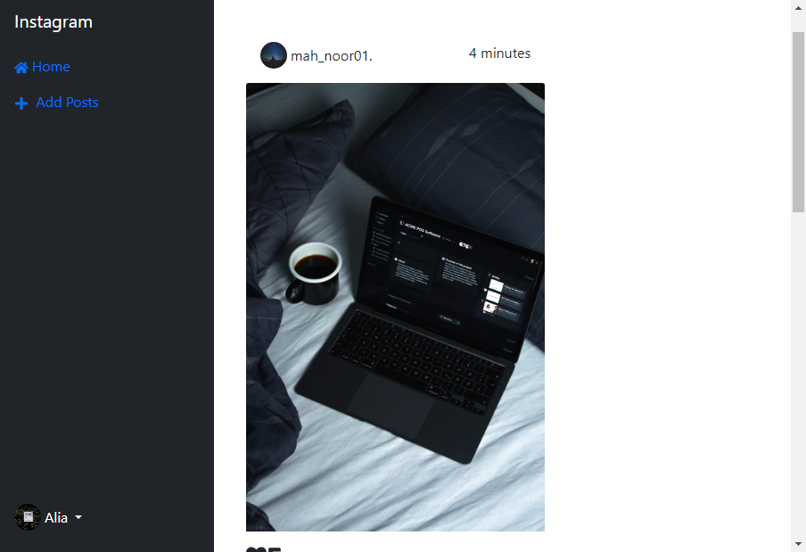
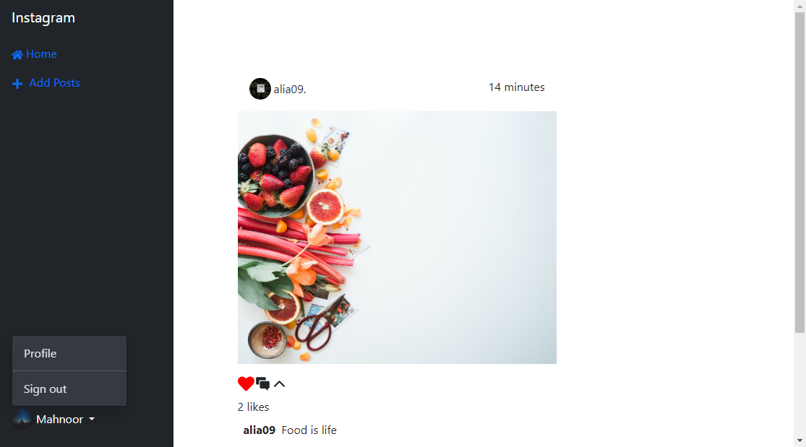
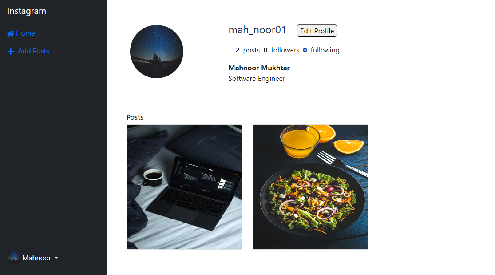

# Instagram Clone Backend(Django)

This is the backend of the Instagram clone project, built using Django.

Take a look at the [frontend](https://github.com/MahnoorMukhtar/instagram_clone_frontend-react-.git) for this project as well.

## Table of Contents

- [Overview](#overview)
- [Features](#features)
- [Installation](#installation)
- [Prerequisites](#prerequisites)
- [Usage](#usage)
- [Technologies Used](#technologies-used)
- [Contributing](#contributing)

## Overview

This Django backend serves as the server-side component for the Instagram clone project. It handles user authentication, post management, and other core functionalities.

## Features

- User authentication (signup, login, logout)
- Image uploading and sharing
- Like and comment on posts
- View other user's posts on main page
- View other user's profile
- Edit your own profile
- Delete your own Posts

## Prerequisites

Before you begin, ensure you have met the following requirements:

- Python and pip installed
- A database server (e.g., PostgreSQL, MySQL)

## Installation

To run the project locally, follow these steps:

### Backend (Django)
1. Create Virtual envronment 
    `python -m venv venv`
2. Activate Virtual Env by runing following command.
    `venv\Scripts\activate`
3. Run `pip install -r requirements.txt` to install all dependencies.
4. Set up database by running ` python manage.py migrate`.
5. Start server using `python manage.py runserver`.

## Usage 
- Open your browser and go to `http://localhost:3000` to access the React frontend.
- The Django backend will be running at `http://localhost:8000`.

## Technologies Used

- Python 
- Django and Django Rest Framework
- PostgreSQL (or your preferred database)

## Screenshots
Welcome page

LoggedIn User Profile

